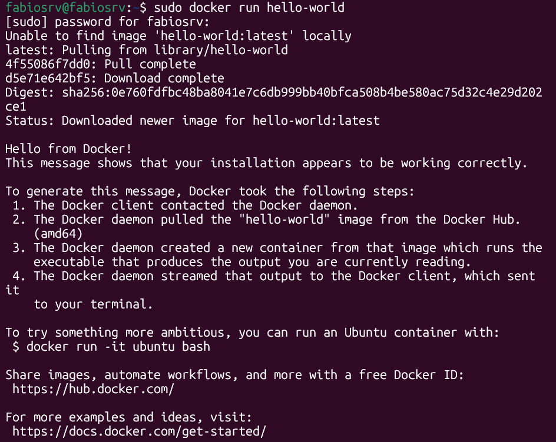
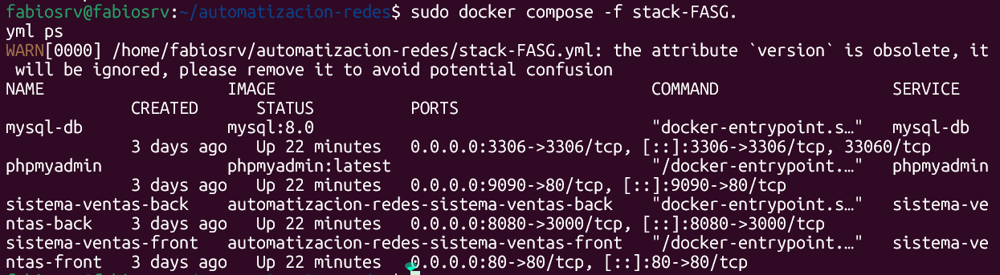

<div align="center">


</div>

# INGENIERÍA. EN REDES INTELIGENTES Y CIBERSEGURIDAD

---

## INSTRUMENTO DE EVALUACIÓN

## Automatización de Infraestructura Digital I

## Unidad I. Entornos de Desarrollo en la Automatización de Redes

**Nombre del Alumno:** FABIO ALONSO SÁNCHEZ GARCÍA - 

**No. Control:** 1223100378

**Grupo:** GIRI6091-e

**Fecha:** 01/06/2026

**Profesor:** Eric Domenzain Morales

---

---

# Índice

1. [Actividad 1](#actividad-1)
   - [Introducción](#introducción)
   - [Desarrollo](#desarrollo)
     - [Descripción de las herramientas utilizadas para automatización](#descripción-de-las-herramientas-utilizadas-para-automatización)
       - [Docker Engine](#docker-engine)
       - [Docker Compose](#docker-compose)
       - [Docker Swagger](#docker-swagger)
     - [Procedimiento de instalación](#procedimiento-de-instalación)
       - [Instalación técnica de herramientas necesarias](#instalación-técnica-de-herramientas-necesarias-vscode-plugins-etc)
       - [Instalación técnica de docker](#instalación-técnica-de-docker)
       - [Instalación técnica de Git](#instalación-técnica-de-git)
     - [Evidencia de pruebas de verificación de funcionamiento](#evidencia-de-pruebas-de-verificación-de-funcionamiento)
       - [Ejecutar la imagen "hello-world" para verificar el funcionamiento de docker](#ejecutar-la-imagen-hello-world-para-verificar-el-funcionamiento-de-docker)
       - [Ejecutar un archivo ".YML" para verificar el funcionamiento de contenedores](#ejecutar-un-archivo-yml-para-verificar-el-funcionamiento-de-contenedores)
   - [Conclusión](#conclusión)
2. [Bibliografía](#bibliografía)

---

# Actividad 1

## Introducción

La presente práctica tiene como finalidad describir el proceso de implementación y configuración de herramientas fundamentales para la gestión de entornos de desarrollo modernos basados en contenedores. En la actualidad, las organizaciones demandan soluciones que permitan optimizar el despliegue de aplicaciones, garantizar la consistencia entre entornos y facilitar la administración de recursos tecnológicos, por lo que el dominio de estas herramientas se ha convertido en una habilidad indispensable para los profesionales del área de tecnologías de la información.

Para el desarrollo de esta actividad se emplearon tecnologías ampliamente utilizadas en entornos empresariales, tales como Docker Engine, Docker Compose y Git. Estas herramientas proporcionan mecanismos que facilitan la creación, administración y distribución de aplicaciones de manera eficiente, permitiendo mantener entornos homogéneos y reduciendo los problemas asociados a la configuración manual de sistemas.

Asimismo, dichas tecnologías forman parte de las prácticas asociadas a DevOps, una metodología orientada a fortalecer la colaboración entre los equipos de desarrollo y operaciones mediante la automatización de procesos y la integración continua. En este contexto, los contenedores representan una alternativa flexible y ligera para la ejecución de aplicaciones, ya que encapsulan tanto el software como sus dependencias en unidades independientes que pueden ejecutarse de manera uniforme en diferentes plataformas. Esta característica contribuye a mejorar la portabilidad, la escalabilidad y la confiabilidad de los sistemas, minimizando las diferencias entre los entornos de desarrollo, prueba y producción.

En las secciones siguientes se presentan las características de las herramientas utilizadas, el procedimiento realizado para su instalación y configuración, las evidencias obtenidas durante la validación del entorno y el análisis de los resultados alcanzados a lo largo de la práctica.


---

## Desarrollo

### Descripción de las herramientas utilizadas para automatización:

#### ■ Docker Engine.

Docker Engine es el núcleo principal de la plataforma Docker, encargado de crear, ejecutar y administrar contenedores. Opera como un servicio en segundo plano (daemon) que recibe instrucciones a través de una interfaz de línea de comandos (CLI) o mediante una API REST. Docker Engine aprovecha características del kernel de Linux como namespaces y cgroups para aislar los procesos dentro de los contenedores, garantizando que cada uno cuente con su propio sistema de archivos, red y espacio de procesos independiente del sistema anfitrión. A diferencia de las máquinas virtuales, los contenedores no requieren un sistema operativo completo, lo que los hace notablemente más ligeros y rápidos de iniciar. Docker Engine es compatible con Linux, Windows y macOS, y constituye la base sobre la cual se construyen las demás herramientas del ecosistema Docker.

#### ■ Docker Compose.

Docker Compose es una herramienta diseñada para definir y gestionar aplicaciones multi-contenedor mediante un archivo de configuración en formato YAML (.yml). En lugar de levantar cada contenedor de forma individual con comandos extensos, Docker Compose permite describir todos los servicios, redes y volúmenes de una aplicación en un solo archivo y ejecutarlos con un único comando. Es especialmente útil en entornos de desarrollo donde una aplicación depende de múltiples servicios, como una base de datos, un servidor web y una API backend. Docker Compose administra automáticamente las dependencias entre servicios, asegurando que se inicien en el orden adecuado.

---

### Procedimiento de instalación:

#### ■ Instalación técnica de herramientas necesarias (VSCode, Plugins, etc.).

Visual Studio Code es el editor de código recomendado para el desarrollo con Docker y Node.js. Para instalarlo en Ubuntu:

```bash
sudo apt-get update
sudo apt-get install wget gpg -y
wget -qO- https://packages.microsoft.com/keys/microsoft.asc | gpg --dearmor > packages.microsoft.gpg
sudo install -o root -g root -m 644 packages.microsoft.gpg /etc/apt/trusted.gpg.d/
sudo sh -c 'echo "deb [arch=amd64] https://packages.microsoft.com/repos/vscode stable main" > /etc/apt/sources.list.d/vscode.list'
sudo apt-get update
sudo apt-get install code -y
```

Los plugins recomendados dentro de VSCode son:

- Docker (Microsoft) ➡ gestión de contenedores desde el editor
- Remote - SSH ➡ conexión a servidores remotos
- GitLens ➡ visualización del historial de Git
- YAML ➡ soporte para archivos .yml

#### ■ Instalación técnica de docker.

```bash
sudo apt-get update
sudo apt-get install docker.io -y
sudo apt-get install docker-compose -y
```

Verificar instalación:

```bash
docker --version
docker-compose --version
```

Agregar usuario al grupo docker (para no usar sudo):

```bash
sudo usermod -aG docker $USER
newgrp docker
```

#### ■ Instalación técnica de Git.

```bash
sudo apt-get update
sudo apt-get install git -y
git --version
```

Configuración inicial:

```bash
git config --global user.name "Tu Nombre"
git config --global user.email "tu@email.com"
```

---

### Evidencia de pruebas de verificación de funcionamiento:

#### ■ Ejecutar la imagen "hello-world" para verificar el funcionamiento de docker.

Para comprobar que Docker Engine se encuentra correctamente instalado y en funcionamiento:

```bash
sudo docker run hello-world
```

**Salida esperada:**

<div align="center">



</div>

---

#### ■ Ejecutar un archivo ".YML" para verificar el funcionamiento de contenedores.

Se utilizó el archivo `stack-FASG.yml` con la configuración de 4 servicios: MySQL, PhpMyAdmin, Backend Node.js y Frontend Angular. El comando para levantar todos los servicios fue:

```bash
sudo docker-compose -f stack-FASGG.yml up --build -d
```

Verificación del estado de los contenedores:

```bash
sudo docker-compose -f stack-FASG.yml ps
```

**Resultado:**

<div align="center">



</div>5

Los 4 servicios se encontraban en estado **Up**, confirmando el correcto funcionamiento del entorno.

---

## Conclusión

En el desarrollo de esta práctica se consiguió implementar correctamente un entorno de trabajo utilizando tecnologías de contenedorización. Durante el proceso se adquirieron conocimientos sobre el funcionamiento de Docker como plataforma para la creación y gestión de contenedores, Docker Compose para la administración de múltiples servicios de manera integrada y Git para el control y seguimiento de cambios en el proyecto.

La actividad permitió poner en marcha una aplicación compuesta por varios componentes, incluyendo una interfaz web desarrollada en Angular, un servidor backend basado en Node.js, una base de datos MySQL y una herramienta de administración mediante PhpMyAdmin. Todos estos elementos lograron interactuar de forma adecuada dentro de un mismo entorno virtualizado.

Asimismo, se enfrentaron diversos desafíos técnicos, tales como problemas de autenticación en la base de datos, restricciones relacionadas con CORS y diferencias entre versiones de Node.js. La resolución de estas incidencias contribuyó a fortalecer las habilidades prácticas y la capacidad de diagnóstico y solución de problemas.

Finalmente, se comprobó que la utilización de contenedores ofrece importantes ventajas en el desarrollo de software, ya que permite crear entornos consistentes, fáciles de transportar y replicar en distintos sistemas, reduciendo problemas de compatibilidad y simplificando la implementación de aplicaciones en diferentes plataformas.


---

## Bibliografía

Docker Inc. (2024). *Docker Engine overview*. Docker Documentation. https://docs.docker.com/engine/

Docker Inc. (2024). *Docker Compose overview*. Docker Documentation. https://docs.docker.com/compose/

Chacon, S., & Straub, B. (2014). *Pro Git* (2nd ed.). Apress. https://git-scm.com/book/en/v2

Linux Foundation. (2024). *Git reference manual*. https://git-scm.com/docs

Microsoft. (2024). *Visual Studio Code documentation*. https://code.visualstudio.com/docs

OpenAPI Initiative. (2024). *OpenAPI Specification*. https://spec.openapis.org/oas/latest.html

Docker Inc. (2024). *Docker Hub*. https://hub.docker.com/